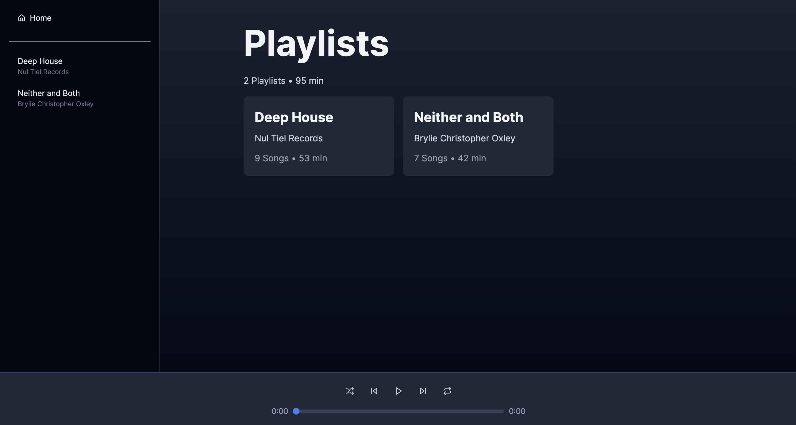
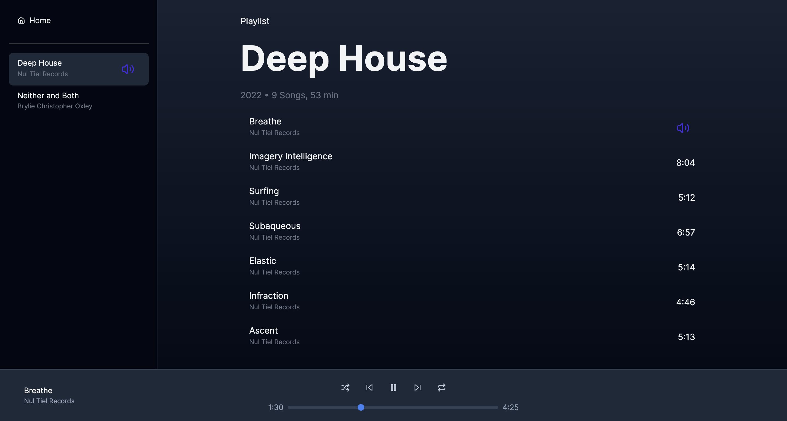

## Home View




## Playlist View (Tracks)



# Linear Media Player

Hey, thanks for taking the time to work on this exercise. We're excited to see what you come up with –
the goal is to create an audio player for playing a predefined playlist of audio files. Think of it
like a stripped-down version of Spotify or the classic Winamp.

### Getting started

Clone this repo which was created _just for you_, make it yours and let us know once the project is complete by pushing
your commits and replying through email. 

You can use `npm` to install the dependencies and run the basic React project. Feel free to add any additional libraries 
or frameworks you need.

```bash
npm install
npm run dev
```

### Requirements

We'd like to see a working media player that can play through a playlist of audio files (included), display info on the
currently playing track and supporting basic functionality like play/pause, next track, etc. Beyond that, feel free to get
creative with the design and functionality.

Plan on spending 2-4 hours to complete this exercise.

Please update this README to include a screenshot of the completed exercise at the top.

### Playlist data

The playlist data is stored in `src/data/playlists.json`. It includes a list of audio files and some associated metadata,
you can import the json file directly with no need for network requests.

### Attribution

This project includes music from the following albums:

- **"Deep House"** by _Nul Tiel Records_ is licensed under [CC BY-NC-SA 4.0](https://creativecommons.org/licenses/by-nc-sa/4.0/).
- **"Neither and Both"** by _Brylie Christopher Oxley_ is licensed under [CC BY 4.0](https://creativecommons.org/licenses/by/4.0/).

--------------------------------------------------------------------------------------------------------------

### Note to Reviewer

The audio player requires an initial click to load metadata before playback controls become fully functional. After this first interaction, all subsequent clicks will operate the audio player as expected. This two-step process is a known limitation in the current implementation that I plan to address in future iterations by enabling immediate playback without the initial click.

## Requirements

- [x] play through a playlist of audio files
- [x] display info on the currently playing track
- [x] supporting basic functionality
  - [x] play/pause
  - [x] next track
